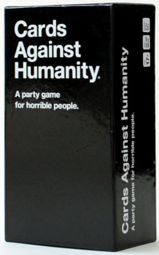

# BIGGEST BLACKEST API

  
  
  

***Disclaimer**: Given the nature of Cards Against Humanity, this repository, its contents, and any usage of it is age restricted to ***Mature Audiences***. The contributors of this project do not share the opinions of the text written in Game, nor on its content*

**Cards Against Humanity has the following disclaimer to their content, which this project adheres to:**
*You must also comply with the Laws of Man and Nature. Don’t use any form of this game for nefarious purposes like libel, slander, diarrhea, copyright infringement, harassment, or death. If you break the law and get in trouble for it, Cards Against Humanity is free of all liability.*

Biggest Blackest API is a play on the *in*famous **Cards Against Humanity** card `The Biggest Blackest Dick`. **Cards Against Humanity** is licensed under the Creative Commons License, which loosely means that as long as you (the end user) don't attempt to make money off of it, you're free to modify, and use it in just about any way you want.

## The Project
This project was heavily inspired by the JSON Against Humanity project, and provides a similar (hopefully expanded** use set for projects. We use GraphQL to provide access to the following:
* Cards  
** Provides Search for cards  
** Allows for paginated results  
** Can shuffle cards, and reuse the same ordering in subsequent requests using a seed  
* Sets  
** Provides a search by set name  
** Paginated results  
** When requesting a single set, the `set(id: "{set_id}")` query should be used, which provides access to the `Card` objects.  

This project was built using `juniper-from-schema`, which analyzes the [[schema.graphql file][./schema.graphql]]. Additionally, the playground (GET "/**) provides a nice way to test out the API directly. The server is running on Actix-Web.

## The Goal
This project is was a tool to learn more about the Rust ecosystem, learn more about Docker and containerization, and build something in GraphQL. In addition, we also hope to create a client application which utilizes this repository as its backbone.

**Updates** are planned to be pushed in a non-obstructive manner. The project relies on a PostgreSQL container to run and hold the cards. When new sets are published and updated, the change script will be placed in a `/migrations/` folder within the image. CRON Jobs will be set up in the image to run and manage the scripts placed here. Feel free to modify and use the folder as well. This will hopefully prevent/reduce data loss on production images running (potentially having collected additional data.

**Other Updates**: We intend for the project to allow users to submit cards for reviewing, and automate the creation of new *Time-Decks*. Decks for each day, week, month, and year can be generated from the highest-rated cards for a given time-period.

## The Game
### Basic Rules
To start the game, each player draws ten white cards.
The player who most recently pooped begins as the Card Czar
and draws a black card. If Hugh Jackman is playing, he goes first,
regardless of how recently he pooped.
The Card Czar reads the question or fill-in-the-blank phrase on the
black card out loud. Everyone else answers the question or fills in
the blank by passing one white card, face down, to the Card Czar.
The Card Czar then shuffles all the answers and reads each card
combination out loud to the group. The Card Czar should re-read
the black card before presenting each answer. Finally, the Card
Czar picks the funniest play, and whoever submitted it gets
one point.
After the round, a new player becomes the Card Czar and everyone
draws back up to ten white cards.
### Gambling
If you have more than one white card that you think could win a
round, you can bet one of your points to play an extra white card.
If you win, you keep the point. If you lose, whoever wins gets the
point you wagered.
### House Rules
Cards Against Humanity is meant to be remixed. Here are some of
our favorite ways to pimp out the rules:  
**Rando Cardrissian**: Every round, pick one random white card from
the pile and place it into play. This card belongs to an imaginary
player named Rando Cardrissian, and if he wins the game, all
players go home in a state of everlasting shame.  
**Happy Ending**: When you’re ready to end the game, play the
“Make a haiku” black card. This is the official ceremonial ending of
a good game of Cards Against Humanity. Note: Haikus don’t need
to follow the 5-7-5 form. They just have to be read dramatically.  
**Never Have I Ever**: At any time, players may discard cards that
they don’t understand, but they must confess their ignorance to the
group and suffer the resulting humiliation.  
**Wheaton’s Law**: Each round, the Card Czar draws two black
cards, chooses the one they’d prefer to play, and puts the other at
the bottom of the black card pile.  
**Rebooting the Universe**: At any time, players may trade in a point
to return as many white cards as they’d like to the deck and draw
back to ten.  
**Packing Heat**: For Pick 2s, all players draw an extra card before
playing the hand to open up more options.  
**Meritocracy**: Instead of passing clockwise, the role of Card Czar
passes to the winner of the previous round.  
**Smooth Operator**: If a player slips a card from their hand into
conversation without anyone noticing, they may trade it for one
point. If the player is called out, they lose a point. If this rule is
confusing, you’re taking this game too seriously.  
**Tie Breaker**: If the Card Czar can’t decide between two white
cards, they may declare a Tie Breaker. In the event of a Tie Breaker,
the more conventionally attractive player wins.  
**Chubby Bunny**: Players crumple up their winning cards and keep
them in their mouths as points.  
**Freaky Friday**: Players play Cards Against Humanity while wearing
their mothers’ underpants.  
**Hard Mode**: Play Cards Against Humanity while raising four kids,
dealing with chronic back pain, and waiting tables at Chili’s. Bonus!
For an added challenge, try being gay or black.  
**Russian Roulette**: The Card Czar takes out a revolver. They place
one bullet at random in the cylinder, spin it, and close it. They then
hold the gun to their head and pull the trigger. If the Card Czar
survives, they defiantly place the gun in the center of the table
and eye the other players, challenging them to pick up the gun “if
they’re man enough.” The Card Czar wins a point.  
**Hail to the Chief**: A player may earn a point at any time by
announcing candidacy for and successfully being elected President
of the United States of America.  
**Race to the Moon**: All players begin masturbating immediately.
Then what happens?  
**Smoke Opium and Play Cards Against Humanity**: Great idea!  
**Wait for Godot**: At the start of the game, instead of drawing a
hand, players stare at the pile of white cards. After an indeterminate
amount of time, players move their gaze to the pile of black cards.
The game doesn’t begin. How can it begin? It has already ended.
In the gloom, players shift their cloudy gaze from pile to pile. Is it
a trick of the light, or do the black cards and white cards seem to
converge in an indistinguishable grayness? Mote by mote, dust
settles on the cards. Nobody accumulates points. Nobody wins.  
**Don’t play Cards Against Humanity**: Walk to a park. Call your
mother. Live a little.

 This work is licensed under a <a rel="license" href="http://creativecommons.org/licenses/by-nc-sa/2.0/">Creative Commons Attribution-NonCommercial-ShareAlike 2.0 Generic License</a>.
